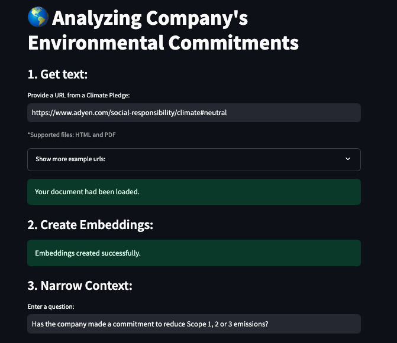

# Analyzing Company's Environmental Commitments

## Motivation
In response to the escalating need to address environmental concerns, many companies are gradually setting new targets 
aimed at reducing their environmental impact and, consequently, their overall footprint on the planet. 
This shift reflects a growing awareness among various stakeholders who seek a comprehensive understanding and effective 
tracking of these environmental goals. Stakeholders often want to ascertain whether companies are not only making bold 
statements about their commitment to sustainability but are also actively working towards achieving these objectives.

For stakeholders ranging from consumers and investors to regulatory bodies, the ability to comprehend and monitor these 
targets is increasingly crucial. The desire is to gauge the actual impact of companies on the environment and evaluate
the extent of their efforts to reduce emissions. The transparency of such efforts is paramount, enabling stakeholders to
make informed decisions about supporting or collaborating with companies based on their environmental practices.

Prominent initiatives such as netZero and browsers like Ecosia have already established noteworthy baselines. The former 
achieves this by extracting data from lengthy documents and presenting it in a clear, tabular manner. Meanwhile, the latter 
categorizes companies from A to E based on their sustainability commitments. Despite the relevance of these initiatives, 
existing processes often involves manual and time-consuming tasks.

In this repository, we explore different approaches to automate the extraction of key variables essential for defining 
a company's Environmental Commitments. This includes detailing scope 1, 2, and 3 emissions, as well as outlining the
ultimate targets that companies aim to achieve in their sustainability journey.

## Usage
To use this repository, clone the repo and:
1. Create a secret to store your personal HuggingFace API token using the following command:
Hard-coding your token:
```bash
kubectl create secret generic huggingface-secret --from-literal=token=<your_token_here>
```
Token stored in a file:
```bash
kubectl create secret generic huggingface-secret --from-file=<file_path>
```
The small application makes use of a GPU to achieve faster results (see utils.py).
If you ren not using a GPU then consider:
- Removing the nodeSelector request from values.yaml
- Updating embeddings and LLM device map

2. From the infrastructure/rag-demo directory, deploy the application by running the following command:
```bash
helm install rag-demo .
```
3. After the pod had been successfully deployed, make it accessible by port-forwarding it to port 8501.
You are all set! go to localhost:8501 and start making questions about your documents.


